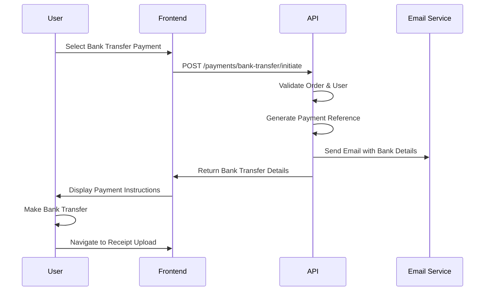

# 💳 Bank Transfer Payment Integration Guide

## 📋 Overview

This guide provides complete frontend integration instructions for the bank transfer payment system. The bank transfer flow allows customers to pay for orders manually by transferring money to configured business bank accounts.

## 🔄 Payment Flow

```
1. Customer creates order → Order ID generated
2. Customer selects "Bank Transfer" payment method
3. System generates unique payment reference
4. Customer receives bank account details & instructions
5. Customer makes transfer using provided reference
6. Customer uploads payment receipt
7. Admin verifies payment → Order status updated
```

## 🚀 API Integration

### 1. Initiate Bank Transfer Payment

**Endpoint:** `POST /api/v1/payments/bank-transfer/initiate`

**Headers:**
```javascript
{
  "Content-Type": "application/json",
  "Authorization": "Bearer <jwt_token>"
}
```

**Request Body:**
```javascript
{
  "orderId": "uuid-string"  // ONLY this field - no amount, provider, or metadata
}
```

**Success Response (200):**
```javascript
{
  "success": true,
  "message": "Bank transfer details provided successfully",
  "data": {
    "reference": "BT-1757678479239-ZWPM9S",
    "orderId": "d911d643-02da-454f-b1c9-5edbe4baeba2",
    "amount": 12000,
    "bankAccounts": [
      {
        "bankName": "Kuda",
        "accountName": "Falade Barakat",
        "accountNumber": "2011445593",
        "currency": "NGN"
      },
      {
        "bankName": "Opay", 
        "accountName": "Abdulrasaq Falade",
        "accountNumber": "9037162097",
        "currency": "NGN"
      }
    ],
    "instructions": [
      "Transfer the exact amount to any of the bank accounts below",
      "Use the reference as your payment description/narration",
      "Upload a clear screenshot or photo of your payment receipt",
      "Your order will be processed once payment is verified by our team",
      "Verification typically takes 1-2 hours during business hours"
    ]
  },
  "timestamp": "2025-09-12T12:01:25.498Z"
}
```

**Error Responses:**
```javascript
// Order not found (404)
{
  "message": "Order not found",
  "error": "Not Found",
  "statusCode": 404
}

// Invalid order status (400)
{
  "message": "Order is not in a valid state for payment",
  "error": "Bad Request", 
  "statusCode": 400
}

// No bank accounts configured (400)
{
  "message": "No bank accounts configured for manual transfers",
  "error": "Bad Request",
  "statusCode": 400
}
```

## 🎨 Frontend Implementation Examples

### React Implementation

```jsx
import React, { useState } from 'react';
import axios from 'axios';

const BankTransferPayment = ({ orderId, onSuccess, onError }) => {
  const [transferDetails, setTransferDetails] = useState(null);
  const [isLoading, setIsLoading] = useState(false);

  const initiateBankTransfer = async () => {
    setIsLoading(true);
    try {
      const token = localStorage.getItem('authToken');
      const response = await axios.post(
        '/api/v1/payments/bank-transfer/initiate',
        { orderId }, // ONLY orderId - no other fields
        {
          headers: {
            'Authorization': `Bearer ${token}`,
            'Content-Type': 'application/json'
          }
        }
      );

      if (response.data.success) {
        setTransferDetails(response.data.data);
        onSuccess?.(response.data.data);
      }
    } catch (error) {
      console.error('Bank transfer initiation failed:', error);
      onError?.(error.response?.data?.message || 'Payment initiation failed');
    } finally {
      setIsLoading(false);
    }
  };

  const copyToClipboard = (text) => {
    navigator.clipboard.writeText(text);
    // Show success message
  };

  if (!transferDetails) {
    return (
      <div className="bank-transfer-init">
        <h3>Bank Transfer Payment</h3>
        <p>Click below to get bank transfer details</p>
        <button 
          onClick={initiateBankTransfer}
          disabled={isLoading}
          className="btn btn-primary"
        >
          {isLoading ? 'Loading...' : 'Get Bank Details'}
        </button>
      </div>
    );
  }

  return (
    <div className="bank-transfer-details">
      <h3>💳 Bank Transfer Instructions</h3>
      
      {/* Amount Display */}
      <div className="amount-section">
        <h4>Amount to Transfer</h4>
        <div className="amount">₦{transferDetails.amount.toLocaleString()}</div>
      </div>

      {/* Payment Reference */}
      <div className="reference-section">
        <h4>Payment Reference (Important)</h4>
        <div className="reference-code">
          <span>{transferDetails.reference}</span>
          <button onClick={() => copyToClipboard(transferDetails.reference)}>
            Copy
          </button>
        </div>
        <small>Use this as your transfer description/narration</small>
      </div>

      {/* Bank Accounts */}
      <div className="bank-accounts">
        <h4>Available Bank Accounts</h4>
        {transferDetails.bankAccounts.map((account, index) => (
          <div key={index} className="bank-account-card">
            <h5>{account.bankName}</h5>
            <p><strong>Account Name:</strong> {account.accountName}</p>
            <div className="account-number">
              <span>{account.accountNumber}</span>
              <button onClick={() => copyToClipboard(account.accountNumber)}>
                Copy
              </button>
            </div>
            <p><strong>Currency:</strong> {account.currency}</p>
          </div>
        ))}
      </div>

      {/* Instructions */}
      <div className="instructions">
        <h4>Payment Instructions</h4>
        <ol>
          {transferDetails.instructions.map((instruction, index) => (
            <li key={index}>{instruction}</li>
          ))}
        </ol>
      </div>

      {/* Next Step Button */}
      <button 
        className="btn btn-success"
        onClick={() => {/* Navigate to receipt upload */}}
      >
        I've Made the Transfer - Upload Receipt
      </button>
    </div>
  );
};

export default BankTransferPayment;
```

### TypeScript Interfaces

```typescript
interface BankAccount {
  bankName: string;
  accountName: string;
  accountNumber: string;
  currency: string;
  sortCode?: string;
}

interface BankTransferResponse {
  reference: string;
  orderId: string;
  amount: number;
  bankAccounts: BankAccount[];
  instructions: string[];
}

interface BankTransferInitiateRequest {
  orderId: string;
}

interface ApiResponse<T> {
  success: boolean;
  message: string;
  data: T;
  timestamp: string;
}
```

### Vue.js Implementation

```vue
<template>
  <div class="bank-transfer-payment">
    <div v-if="!transferDetails" class="init-section">
      <h3>Bank Transfer Payment</h3>
      <button 
        @click="initiateBankTransfer"
        :disabled="loading"
        class="btn-primary"
      >
        {{ loading ? 'Loading...' : 'Get Bank Details' }}
      </button>
    </div>

    <div v-else class="transfer-details">
      <h3>💳 Bank Transfer Instructions</h3>
      
      <div class="amount-display">
        <h4>Amount: ₦{{ transferDetails.amount.toLocaleString() }}</h4>
      </div>

      <div class="reference-display">
        <h4>Reference: {{ transferDetails.reference }}</h4>
        <button @click="copyReference">Copy Reference</button>
      </div>

      <div class="bank-accounts">
        <div 
          v-for="(account, index) in transferDetails.bankAccounts" 
          :key="index"
          class="bank-card"
        >
          <h5>{{ account.bankName }}</h5>
          <p>{{ account.accountName }}</p>
          <p>{{ account.accountNumber }}</p>
        </div>
      </div>
    </div>
  </div>
</template>

<script>
export default {
  name: 'BankTransferPayment',
  props: {
    orderId: {
      type: String,
      required: true
    }
  },
  data() {
    return {
      transferDetails: null,
      loading: false
    }
  },
  methods: {
    async initiateBankTransfer() {
      this.loading = true;
      try {
        const response = await this.$http.post('/api/v1/payments/bank-transfer/initiate', {
          orderId: this.orderId
        });
        
        if (response.data.success) {
          this.transferDetails = response.data.data;
        }
      } catch (error) {
        this.$toast.error('Failed to get bank transfer details');
      } finally {
        this.loading = false;
      }
    },
    
    copyReference() {
      navigator.clipboard.writeText(this.transferDetails.reference);
      this.$toast.success('Reference copied to clipboard');
    }
  }
}
</script>
```

## 🎨 CSS Styling Suggestions

```css
.bank-transfer-details {
  max-width: 600px;
  margin: 0 auto;
  padding: 20px;
}

.amount-section {
  background: #e3f2fd;
  border: 2px solid #2196f3;
  border-radius: 8px;
  padding: 20px;
  text-align: center;
  margin: 20px 0;
}

.amount {
  font-size: 2em;
  font-weight: bold;
  color: #2196f3;
}

.reference-section {
  background: #fff3e0;
  border: 2px solid #ff9800;
  border-radius: 8px;
  padding: 20px;
  text-align: center;
  margin: 20px 0;
}

.reference-code {
  display: flex;
  align-items: center;
  justify-content: center;
  gap: 10px;
  font-family: monospace;
  font-size: 1.2em;
  font-weight: bold;
}

.bank-account-card {
  border: 1px solid #ddd;
  border-radius: 8px;
  padding: 15px;
  margin: 10px 0;
  background: #f9f9f9;
}

.account-number {
  display: flex;
  align-items: center;
  gap: 10px;
  font-family: monospace;
  font-weight: bold;
}

.instructions {
  background: #f0f8ff;
  border-left: 4px solid #2196f3;
  padding: 15px;
  margin: 20px 0;
}
```

## ⚠️ Important Notes

### ❌ Common Mistakes to Avoid

1. **Wrong Request Body Structure**
   ```javascript
   // ❌ WRONG - Don't send extra fields
   {
     "orderId": "uuid",
     "amount": 12000,        // Don't include
     "provider": "manual",   // Don't include
     "metadata": {}          // Don't include
   }
   
   // ✅ CORRECT - Only orderId
   {
     "orderId": "uuid"
   }
   ```

2. **Missing Authorization Header**
   ```javascript
   // ❌ WRONG
   fetch('/api/v1/payments/bank-transfer/initiate', {
     method: 'POST',
     body: JSON.stringify({ orderId })
   });
   
   // ✅ CORRECT
   fetch('/api/v1/payments/bank-transfer/initiate', {
     method: 'POST',
     headers: {
       'Authorization': `Bearer ${token}`,
       'Content-Type': 'application/json'
     },
     body: JSON.stringify({ orderId })
   });
   ```

3. **Not Handling Error States**
   - Always check for 404 (order not found)
   - Handle 400 errors (invalid order state)
   - Show meaningful error messages to users

### ✅ Best Practices

1. **Store Transfer Details**
   - Save reference and bank details locally
   - Allow users to revisit payment instructions

2. **Copy to Clipboard Functionality**
   - Make reference and account numbers easily copyable
   - Provide visual feedback when copied

3. **Mobile-Friendly Design**
   - Make bank details easily readable on mobile
   - Consider QR codes for account numbers

4. **Clear Visual Hierarchy**
   - Highlight the payment reference prominently
   - Use clear sections for amount, reference, and accounts

## 🔄 Integration Workflow



## 🚀 Next Steps

After implementing bank transfer initiation, you'll also need:

1. **Receipt Upload Flow** - Allow users to upload payment receipts
2. **Payment Status Check** - Let users check payment verification status
3. **Order Status Updates** - Show when payments are verified
4. **Admin Verification Interface** - For admins to verify uploaded receipts

## 📞 Support

If you encounter issues during integration:
- Check browser console for error details
- Verify JWT token is not expired
- Ensure order exists and belongs to the user
- Confirm request payload structure matches exactly

This completes the bank transfer payment integration guide. The system is fully functional and ready for frontend implementation! 🎉